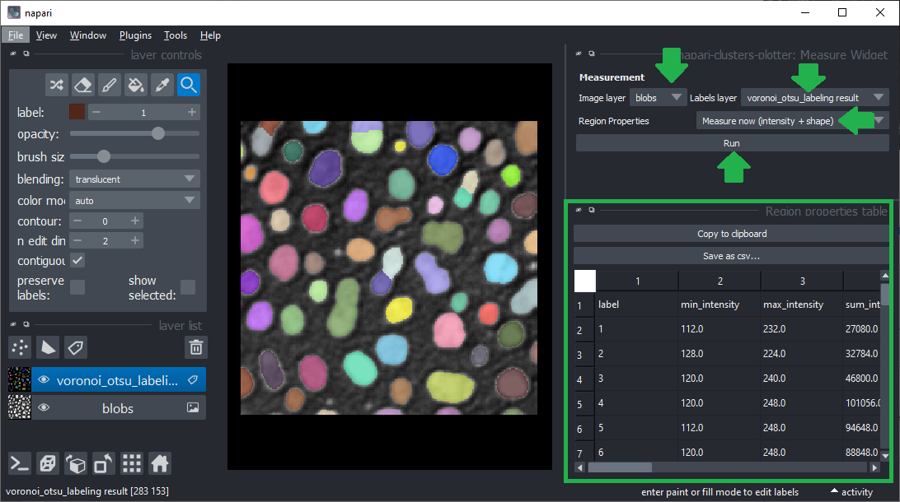
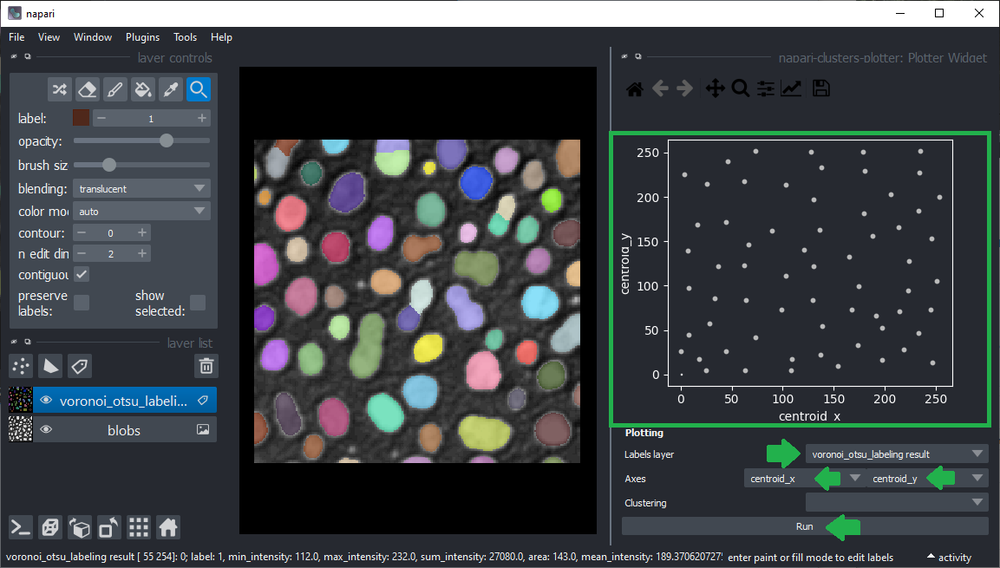
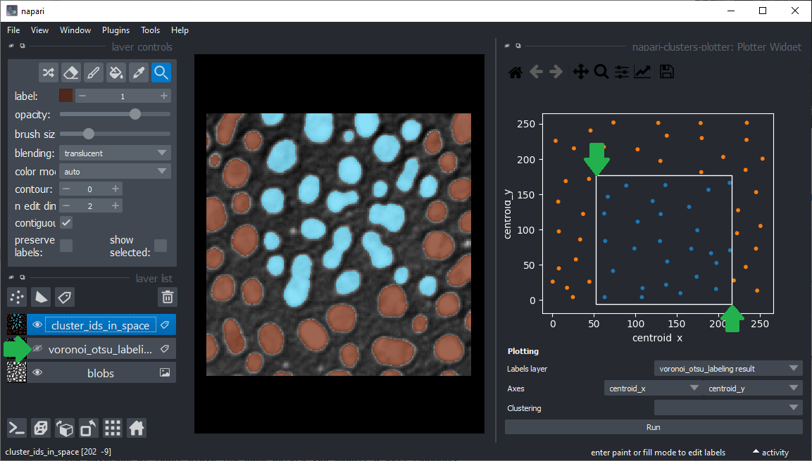
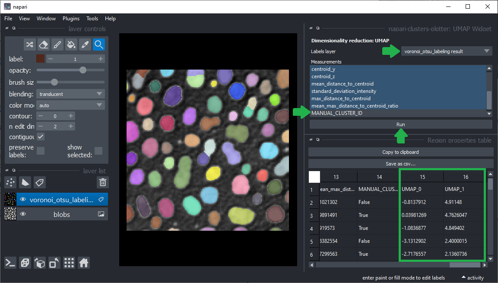
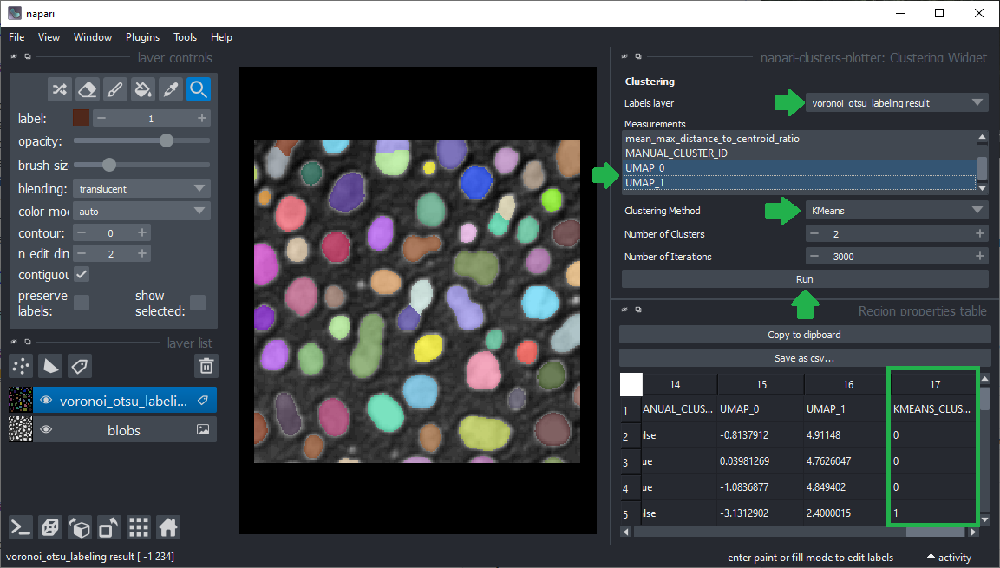
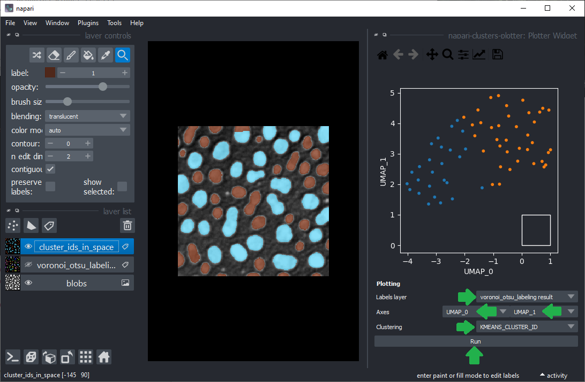

# napari-clusters-plotter

A plugin to use with napari for clustering objects according to their properties.

----------------------------------

This [napari] plugin was generated with [Cookiecutter] using with [@napari]'s [cookiecutter-napari-plugin] template.

## Usage

### Starting point
For clustering objects according to their properties, the starting point is a [grey-value image](example_data/blobs.tif) and a label image
representing a segmentation of objects. For segmenting objects, you can for example use the 
[Voronoi-Otsu-labeling approach](https://github.com/haesleinhuepf/napari-segment-blobs-and-things-with-membranes#voronoi-otsu-labeling)
in the napari plugin [napari-segment-blobs-and-things-with-membranes](https://www.napari-hub.org/plugins/napari-segment-blobs-and-things-with-membranes).

### Measurements
The first step is deriving measurements from the labeled image and the corresponding pixels in the grey-value image.
You can use the menu `Plugins > napari-clusters-plotter > Measure Widget` for that. 
Just select the image, the corresponding label image and the measurements to analyse and click on `Run`.
A table with the measurements will open:

Afterwards, you can save and/or close the measurement table. Also, close the Measure widget. Or if you want you can
interact with labels and see which row of the table corresponds to which labelled object. For this, use the Pick mode
in napari and activate the show selected checkbox. Alternatively, you can also select a specific row of the table and
appropriate label is displayed (make sure that show selected checkbox is selected).

ADD AN IMAGE WITH label picker AND the show selected checkbox displayed.

### Plotting

Once measurements were made, these measurements were saved in the `properties` of the labels layer which was analysed.
You can then plot these measurements using the menu `Plugins > napari-clusters-plotter > Plotter widget`.

In this widget, you can select the labels layer which was analysed and the measurements which should be plotted
on the X- and Y-axis. Click on Run to draw the data points in the plot area.

You can also manually select a region in the plot. The resulting manual clustering will also be visualized in the 
original image. To optimize visualization in the image, turn off the visibility of the analysed labels layer.

You can also select a labeled object using the `Pick` mode in napari and see which data point in the plot it 
corresponds to.

### Dimensionality reduction: UMAP

For getting more insights into your data, you can reduce the dimensionality of the measurements, e.g.
using the [UMAP algorithm](https://umap-learn.readthedocs.io/en/latest/).
To apply it to your data use the menu `Plugins > napari-clusters-plotter > UMAP widget`.
Select the label image that was analyzed and in the list below, select all measurements that should be
dimensionality reduced. Make sure to unselect "label" and other "clustering" results, but
only quantitative measurements such as intensity, size and shape. Click on "Run" and after a moment,
the table of measurements will re-appear with two additional columns representing the reduced dimensions of the
dataset.

Afterwards, you can again save and/or close the table. Also, close the UMAP widget.

### k-means clustering
If manual clustering, as shown above, is not an option, you can automatically cluster your data, e.g. using the
[k-means clustering algorithm](). 
Therefore, click the menu `Plugins > napari-clusters-plotter > Clustering widget`,
again, select the analyzed labels layer.
This time select the measurements for clustering, e.g. select _only_ the `UMAP` measurements.
Select the clustering method `KMeans` and click on `Run`. 
The table of measurements will reappear with an additional column `KMEANS_CLUSTERING_ID` containing the cluster ID of 
each datapoint.

Afterwards, you can again save and/or close the table. Also, close the clustering widget.

### Plotting k-means clustering results.
Return to the Plotter widget using the menu `Plugins > napari-clusters-plotter > Plotter widget`.
Select `UMAP_0` and `UMAP_1` as X- and Y-axis and the `KMEANS_CLUSTERING_ID` as `Cluster`

## Installation

You can install `napari-clusters-plotter` via [pip]:

    pip install napari-clusters-plotter

## Contributing

Contributions are very welcome. Tests can be run with [tox], please ensure
the coverage at least stays the same before you submit a pull request.

## License

Distributed under the terms of the [BSD-3] license,
"napari-clusters-plotter" is free and open source software

## Issues

If you encounter any problems, please [file an issue] along with a detailed description.

[napari]: https://github.com/napari/napari
[Cookiecutter]: https://github.com/audreyr/cookiecutter
[@napari]: https://github.com/napari
[MIT]: http://opensource.org/licenses/MIT
[BSD-3]: http://opensource.org/licenses/BSD-3-Clause
[GNU GPL v3.0]: http://www.gnu.org/licenses/gpl-3.0.txt
[GNU LGPL v3.0]: http://www.gnu.org/licenses/lgpl-3.0.txt
[Apache Software License 2.0]: http://www.apache.org/licenses/LICENSE-2.0
[Mozilla Public License 2.0]: https://www.mozilla.org/media/MPL/2.0/index.txt
[cookiecutter-napari-plugin]: https://github.com/napari/cookiecutter-napari-plugin

[napari]: https://github.com/napari/napari
[tox]: https://tox.readthedocs.io/en/latest/
[pip]: https://pypi.org/project/pip/
[PyPI]: https://pypi.org/
