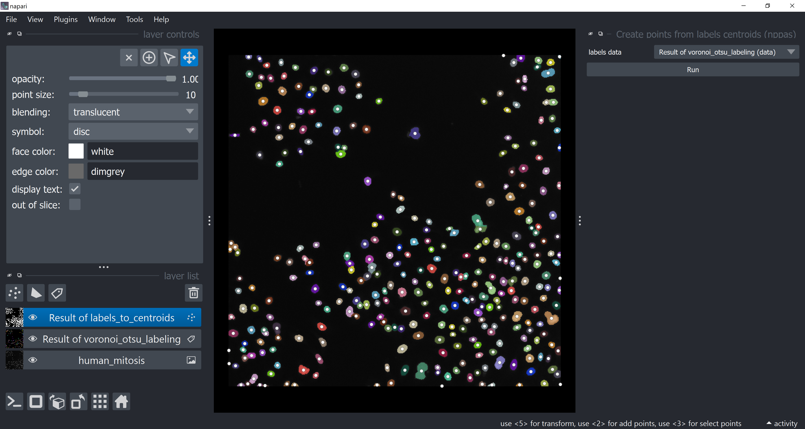
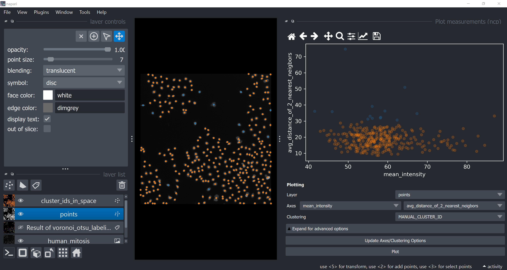
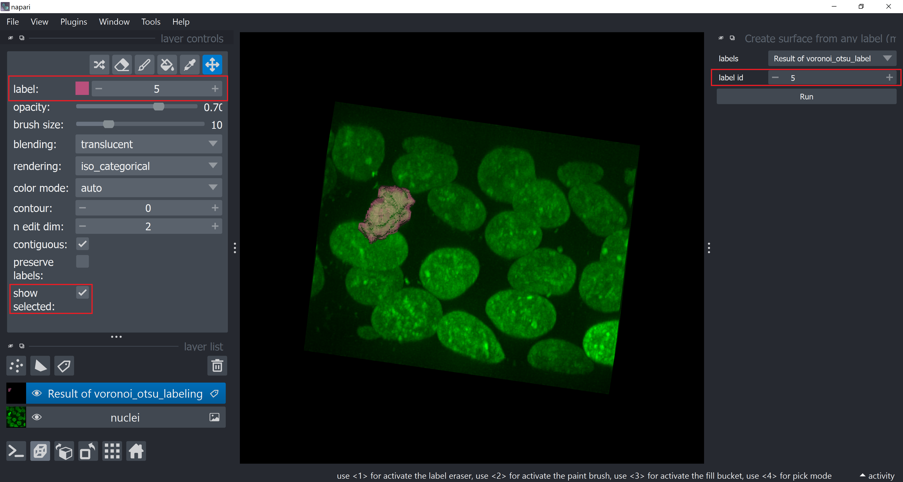
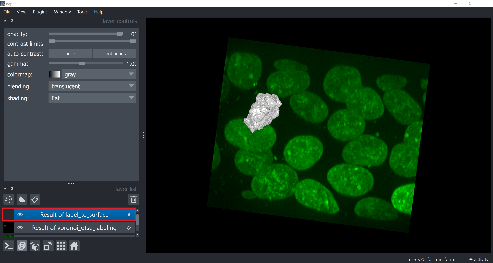
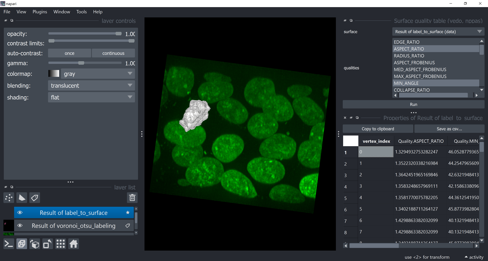
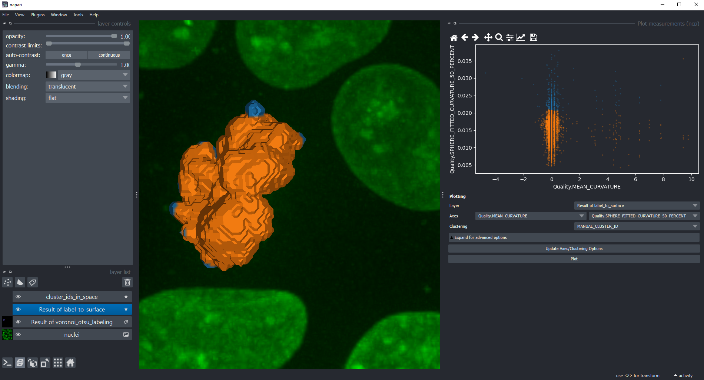
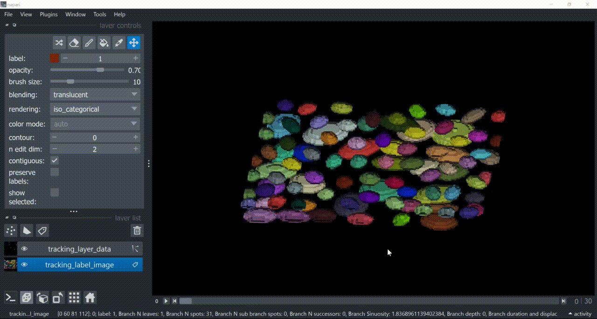

# napari-clusters-plotter

[](https://github.com/lazigu/napari-clusters-plotter/raw/master/LICENSE)
[](https://pypi.org/project/napari-clusters-plotter)
[](https://python.org)
[](https://anaconda.org/conda-forge/napari-clusters-plotter)
[](https://github.com/BiAPoL/napari-clusters-plotter/actions/workflows/test_and_deploy.yml)
[](https://codecov.io/gh/BiAPoL/napari-clusters-plotter)
[](https://github.com/pre-commit/pre-commit)
[](https://anaconda.org/conda-forge/napari-clusters-plotter)
[](https://www.napari-hub.org/plugins/napari-clusters-plotter)
[](https://doi.org/10.5281/zenodo.7011471)

A napari-plugin for clustering objects according to their properties.


----------------------------------
**Note: support for other layers besides the `Labels` layer as described below is currently only available in the development version. This note will be removed as soon as there is a new release.**

Jump to:
- [Usage](#usage)
  - [Starting point](#starting-point)
  - [Labels layer with Segmentation Results](#1-labels-layer-with-segmentation-results)
    - [Measurements](#measurements)
    - [Plotting](#plotting)
    - [Manual clustering](#manual-clustering)
    - [Saving manual clustering](#saving-manual-clustering)
    - [Time-Lapse analysis](#time-lapse-analysis)
  - [Points Layer with Coordinates](#2-points-layer-with-coordinates)
  - [Surface Layer with Segmentation Results](#3-surface-layer-with-segmentation-results)
  - [Labels Layer with Tracking Results](#4-labels-layer-with-tracking-results)
  - [Dimensionality reduction](#4-dimensionality-reduction)
  - [Clustering](#5-clustering)
  - [Plotting clustering results](#6-plotting-clustering-results)
- [Installation](#installation)
- [Troubleshooting installation](#troubleshooting-installation)
- [Contributing](#contributing)
- [License](#license)
- [Acknowledgements](#acknowledgements)
- [Issues](#issues)

## Usage

### Starting point
For clustering objects according to their properties, the starting point is a [grey-value image](example_data/blobs.tif) and another layer containing derived measurements in the `.features` property. Here are the supported layer types along with *examples of what they may represent*:
1. `Labels` layer containing a label image representing a **segmentation** of objects.
2. `Points` layer containing points representing centroid **coordinates** of objects.
3. `Surface` layer containing a surface representing a **segmentation** of an object.
4. `Labels` layer containing a time-lapse label image representing **tracking** results, where each label number/color correspond to a unique track ID.

Check the [examples data folder](./example_data/) to learn how to load these data with code.

### 1. Labels layer with Segmentation Results

The label image should not contain objects with the label `0` as these objects cannot be separated from the background, which is `0` as well in many images and would lead into erroneous behaviour when performing the clustering.
For segmenting objects, you can for example use the [Voronoi-Otsu-labelling approach](https://github.com/haesleinhuepf/napari-segment-blobs-and-things-with-membranes#voronoi-otsu-labelling)
in the napari plugin [napari-segment-blobs-and-things-with-membranes](https://www.napari-hub.org/plugins/napari-segment-blobs-and-things-with-membranes).


In case you have 2D time-lapse data you need to convert it into a suitable shape using the menu `Tools > Utilities > Convert 3D stack to 2D time-lapse (time-slicer)` ([documentation](https://www.napari-hub.org/plugins/napari-time-slicer)).

#### Measurements
The first step is deriving measurements from the labeled image and the corresponding pixels in the grey-value image.
Use the menu `Tools > Measurement tables > Regionprops (scikit-image, nsr)` to get to the measurement widget ([documentation](https://www.napari-hub.org/plugins/napari-skimage-regionprops)).
Select the image, the corresponding label image and the measurements to analyse and click on `Run`.
A table with the measurements will open and afterwards, you can save and/or close the measurement table.
At this point it is recommended to close the table and the Measure widget to free space for following steps.

You can also load your own measurements. You can do this using the menu `Tools > Measurement > Load from CSV (nsr)`.
If you load custom measurements, please make sure that there is a `label` column that specifies which measurement belongs to which labeled object.
Make sure to avoid the label `0` as this is reserved for the background. Tables for time-lapse data need to include an additional column named `frame`.

#### Plotting

Once measurements were saved in the labels layer which was analysed, you can then plot these measurements using the menu `Tools > Visualization > Plot measurements (ncp)`.

In this widget, you can select the labels layer which was analysed and the measurements which should be plotted
on the X- and Y-axis. Click on `Plot` to draw the data points in the plot area.


Under advanced options, you can also select the plot type histogram which will visualize a 2D histogram. 2D histogram visualization is recommended if you have a very high number of data points.


If you choose the same measurement for the X and the Y axis, a histogram will be shown.


Under advanced options you will also find the checkbox determining whether not-selected data points should be hidden (shown in grey) or automatically
clustered as another cluster.

#### Manual clustering

You can manually select a region in the plot. To use lasso (freehand) tool use left mouse click, and to use a
rectangle - right click. The resulting manual clustering will also be visualized in the original image. To optimize
visualization in the image, turn off the visibility of the analysed labels layer.


Hold down the SHIFT key while annotating regions in the plot to manually select multiple clusters.


#### Saving manual clustering

Manual clustering results can be saved by going to `Tools > Measurement > Show table (nsr)`, and clicking on `Save as csv`.
The saved table will contain a "MANUAL_CLUSTER_ID" column. This column is overwritten every time different clusters are manually selected.

#### Time-Lapse analysis

When you plot your time-lapse datasets you will notice that the plots look slightly different.
Datapoints of the current time frame are highlighted in bright color and you can see the datapoints move through the plot while you navigate through time:


You can also manually select groups using the lasso tool and plot a measurement per frame and see how the group behaves in time.
Furthermore, you could also select a group in time and see where the datapoints lie in a different feature space:


If you have custom measurements from **tracking data** where each column specifies measurements for a track instead of a label at a specific time point, the `frame` column must not be added. Check [below]() how tracking data and features should look like.

### 2. Points Layer with Coordinates

The `Points` layer typically contains coordinates of objects of interest (for example, object centroids).

To get these coordinates, you can apply spot detection algorithms (check references [here with scikit-image](https://scikit-image.org/docs/stable/auto_examples/segmentation/plot_peak_local_max.html), [here with pyclesperanto](https://haesleinhuepf.github.io/BioImageAnalysisNotebooks/23_blob_detection/local_maxima_detection.html) and [here for the spotflow plugin](https://github.com/weigertlab/napari-spotiflow?tab=readme-ov-file#napari-spotiflow)) or, if you have segmentation results, use objects centroids as coordinates. This last approach can be done via `Tools > Points > Create points from labels centroids (nppas)` from the [napari-process-points-and-surfaces plugin](https://github.com/haesleinhuepf/napari-process-points-and-surfaces?tab=readme-ov-file#napari-process-points-and-surfaces-nppas):



You can load object features to these points by assigning them to the `.feature` attribute of the `Points` layer, like this in Python:

`points_layer.features = features_table`

The number of rows in the table should match the number of points.

You can cluster these features using the same algorithms explained furhter down, or manually, and get points colored accordingly, like shown below:



Check also [this notebook](./example_data/points_data/loading_points_data_example.ipynb) to learn how to load these data from code.

### 3. Surface Layer with Segmentation Results

The `Surface` layer could contain a surface representing a segmentation result.

To generate this surface from a labeled image containing the segmentation results, a classical algorithm is the [Marching Cubes](https://en.wikipedia.org/wiki/Marching_cubes). It is available in [scikit-image](https://scikit-image.org/docs/stable/api/skimage.measure.html#skimage.measure.marching_cubes), and you can also apply it via `Tools > Surfaces > Create surface from any label (marching cubes, scikit-image, nppas)` from the [napari-process-points-and-surfaces plugin](https://github.com/haesleinhuepf/napari-process-points-and-surfaces?tab=readme-ov-file#napari-process-points-and-surfaces-nppas). Choose which label id number you want to turn into a surface and click on `Run`:



You will notice that the surface layer will be created.



You can derive quantitative measurements from the vertices of a surface via `Tools > Measurement tables > Surface quality table (vedo, nppas)` from [napari-process-points-and-surfaces plugin](https://github.com/haesleinhuepf/napari-process-points-and-surfaces?tab=readme-ov-file#surface-measurements-and-annotations):



Surface vertex measurements can be plotted and classified the same way with the plotter (`Tools > Visualization > Plot measurements (ncp)`):



Check [this notebook](./example_data/surface_data/loading_surface_data_example.ipynb) to learn how to load these data from code.

### 4. Labels Layer with Tracking Results

The **`Labels`** layer can be also used to display tracking results.

[These notebooks](https://github.com/BiAPoL/napari-clusters-plotter-example-notebooks/tree/main/notebooks/mastodon) show you examples of how to load and format tracking features from [Mastodon](https://imagej.net/plugins/mastodon) in a way compatible with napari-clusters-plotter.

For example, if you have a time-lapse labeled image where each label number represents a unique track ID, you can load tracking features to this `Labels` layer and use the plotter to cluster them. In the 'gif' below, the `Tracks` layer is NOT used for clustering, it is just shown along as a convenience. There is currently no support for the `Tracks` layer.



Check [this notebook](./example_data/tracking_data/loading_tracking_data_example.ipynb) to learn how to load these data from code.

### 4. Dimensionality reduction

For getting more insights into your data, you can reduce the dimensionality of the measurements, using these algorithms:
* [Uniform Manifold Approximation Projection (UMAP)](https://umap-learn.readthedocs.io/en/latest/)
* [t-distributed stochastic neighbor embedding (t-SNE)](https://scikit-learn.org/stable/modules/generated/sklearn.manifold.TSNE.html)
* [Principal Component Analysis (PCA)](https://scikit-learn.org/stable/modules/generated/sklearn.decomposition.PCA.html)
* [Non-linear dimensionality reduction through Isometric Mapping (Isomap)](https://scikit-learn.org/stable/modules/generated/sklearn.manifold.Isomap.html)
* [Multi-dimensional Scaling (MDS)](https://scikit-learn.org/stable/modules/manifold.html#multidimensional-scaling)

To apply them to your data use the menu `Tools > Measurement post-processing > Dimensionality reduction (ncp)`.
Select the label image that was analysed and in the list below, select all measurements that should be dimensionality reduced.
By default, all measurements are selected in the box.
You can read more about parameters of both algorithms by hovering over question marks or by clicking on them.
When you are done with the selection, click on `Run` and after a moment, the table of measurements will re-appear with two additional columns representing the reduced dimensions of the dataset.
These columns are automatically saved in the labels layer and can be further processed by other plugins.


Afterwards, you can again save and/or close the table.

### 5. Clustering
If manual clustering, as shown above, is not an option, you can automatically cluster your data, using these implemented algorithms:
* [k-means clustering (KMEANS)](https://towardsdatascience.com/k-means-clustering-algorithm-applications-evaluation-methods-and-drawbacks-aa03e644b48a)
* [Hierarchical Density-Based Spatial Clustering of Applications with Noise (HDBSCAN)](https://hdbscan.readthedocs.io/en/latest/how_hdbscan_works.html)
* [Gaussian Mixture Model (GMM)](https://scikit-learn.org/stable/modules/mixture.html)
* [Mean Shift (MS)](https://scikit-learn.org/stable/auto_examples/cluster/plot_mean_shift.html#sphx-glr-auto-examples-cluster-plot-mean-shift-py)
* [Agglomerative clustering (AC)](https://scikit-learn.org/stable/modules/generated/sklearn.cluster.AgglomerativeClustering.html)

Therefore, click the menu `Tools > Measurement post-processing > Clustering (ncp)`,
select the analysed labels layer.
Select the measurements for clustering, e.g. select _only_ the `UMAP` measurements.
Select the clustering method `KMeans` and click on `Run`.
The table of measurements will reappear with an additional column `ALGORITHM_NAME_CLUSTERING_ID` containing the cluster
ID of each datapoint.


Afterwards, you can save and/or close the table.

### 6. Plotting clustering results

Return to the Plotter widget using the menu `Tools > Visualization > Plot measurement (ncp)`.
Select `UMAP_0` and `UMAP_1` as X- and Y-axis and the `ALGORITHM_NAME_CLUSTERING_ID` as `Clustering`, and click on `Plot`.


## Installation
### Devbio-napari installation

The easiest way to install this plugin is to install the [devbio-napari](https://github.com/haesleinhuepf/devbio-napari) plugin collection. The napari-clusters-plotter is part of it.

### Minimal installation
* Get a python environment, e.g. via [mini-conda](https://docs.conda.io/en/latest/miniconda.html).
  If you never used mamba/conda environments before, please follow the instructions
  [in this blog post](https://biapol.github.io/blog/mara_lampert/getting_started_with_mambaforge_and_python/readme.html) first.

* Create a new environment, for example, like this:

```
mamba create --name ncp-env python=3.9
```

* Activate the new environment via conda:

```
mamba activate ncp-env
```

* Install [napari], e.g. via [conda]:

```
mamba install -c conda-forge napari
```

Afterwards, you can install `napari-clusters-plotter`, e.g. via [conda]:

```
mamba install -c conda-forge napari-clusters-plotter
```

## Troubleshooting installation

- `Error: Could not build wheels for hdbscan which use PEP 517 and cannot be installed directly`

This can happen if you used pip for the installation. To solve this error, install hdbscan via conda before installing the plugin:

```
mamba install -c conda-forge hdbscan
```

- `ValueError: numpy.ndarray size changed, may indicate binary incompatibility. Expected 96 from C header, got 88 from PyObject`

Similar to the above-described error, this error can occur when importing hdbscan through pip or in the wrong order. This can be fixed by installing packages separately through conda and in the following order:
```bash
mamba install -c conda-forge napari hdbscan
pip install napari-clusters-plotter
```

## Contributing

Contributions are very welcome. Tests can be run with [pytest], please ensure
the coverage at least stays the same before you submit a pull request.

## License

Distributed under the terms of the [BSD-3] license,
"napari-clusters-plotter" is free and open source software

## Acknowledgements
This project was supported by the Deutsche Forschungsgemeinschaft under Germany’s Excellence Strategy – EXC2068 - Cluster of Excellence "Physics of Life" of TU Dresden.
This project has been made possible in part by grant number [2021-240341 (Napari plugin accelerator grant)](https://chanzuckerberg.com/science/programs-resources/imaging/napari/improving-image-processing/) from the Chan Zuckerberg Initiative DAF, an advised fund of the Silicon Valley Community Foundation.

## Issues

If you encounter any problems, please [file an issue](https://github.com/BiAPoL/napari-clusters-plotter/issues) along
with a detailed description.

[napari]: https://github.com/napari/napari
[Cookiecutter]: https://github.com/audreyr/cookiecutter
[@napari]: https://github.com/napari
[MIT]: http://opensource.org/licenses/MIT
[BSD-3]: http://opensource.org/licenses/BSD-3-Clause
[GNU GPL v3.0]: http://www.gnu.org/licenses/gpl-3.0.txt
[GNU LGPL v3.0]: http://www.gnu.org/licenses/lgpl-3.0.txt
[Apache Software License 2.0]: http://www.apache.org/licenses/LICENSE-2.0
[Mozilla Public License 2.0]: https://www.mozilla.org/media/MPL/2.0/index.txt
[cookiecutter-napari-plugin]: https://github.com/napari/cookiecutter-napari-plugin

[napari]: https://github.com/napari/napari
[pytest]: https://docs.pytest.org/en/7.0.x/
[pip]: https://pypi.org/project/pip/
[PyPI]: https://pypi.org/
[conda]: https://docs.conda.io/projects/conda/en/latest/
