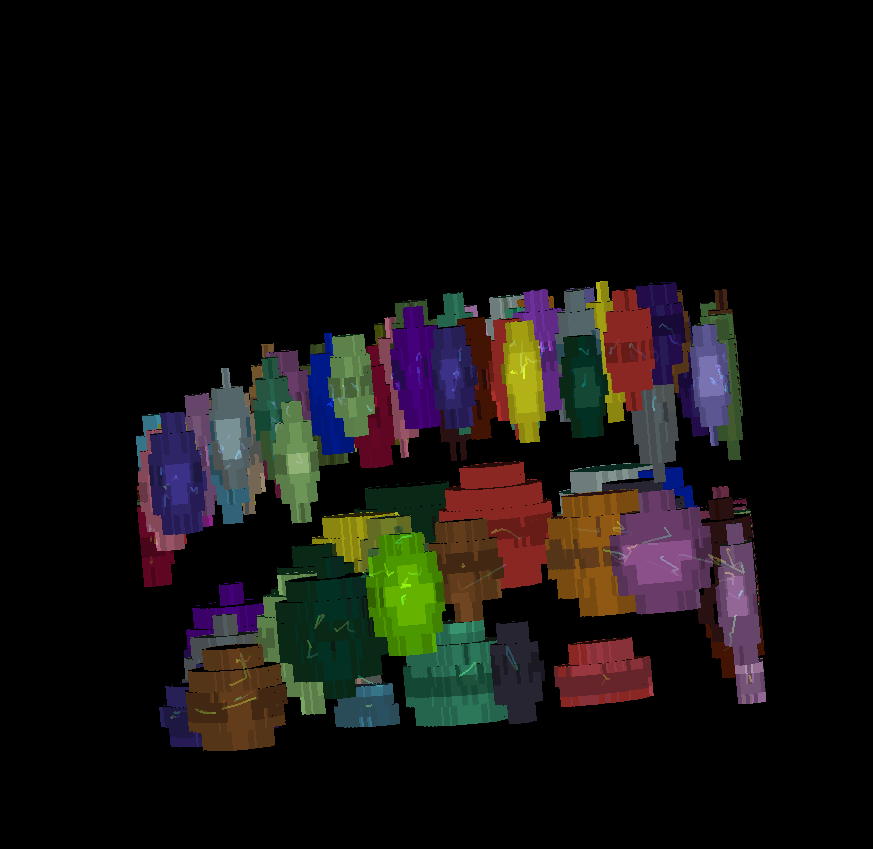

# Sample data

The napari-clusters-plotter comes with a number of sample data files for you to test and play with the functionality of the plugin. Here we list where these sample data have been taken from and how to load them into napari.

## Labels: BBBC1-Data

For demo raw image and segmentations as label images, we used image set BBBC007v1 image set version 1 (Jones et al., Proc. ICCV Workshop on Computer Vision for Biomedical Image Applications, 2005), available from the [Broad Bioimage Benchmark Collection](https://bbbc.broadinstitute.org/BBBC007) [Ljosa et al., Nature Methods, 2012]. Images were cropped with a 340x340 window size and converted to 16-bit format. The segmentations have been created using the voronoi-otsu-algorithm from [napari-segment-things-with-blobs-and-membranes](https://github.com/haesleinhuepf/napari-segment-blobs-and-things-with-membranes). The dataset includes several images and their corresponding segmentations side-by-side in the napari viewer.

The dataset is available in the napari viewer under `File > Open Sample > napari clusters plotter > BBBC 1 dataset & segmentations`

## Surface: Cells3d curvatures

For surface (aka mesh) data, we segmented and converted a piece of the [scikit-image cells3d example dataset](https://scikit-image.org/docs/stable/api/skimage.data.html#skimage.data.cells3d). The data were converted according to [this notebook](https://github.com/haesleinhuepf/napari-process-points-and-surfaces/blob/main/docs/demo.ipynb) from the [napari-process-points-and-surfaces](https://github.com/haesleinhuepf/napari-process-points-and-surfaces) plugin. The dataset includes a raw image of a mitotic cell and its corresponding surface mesh. Mean and Gaussian curvatures have been measured on the surface with the [patch-fitting algorithm](https://campaslab.github.io/napari-stress/05_API/measurements.html#napari_stress.measurements.calculate_patch_fitted_curvature_on_surface) taken from the [napari-stress plugin](https://github.com/campaslab/napari-stress)

The dataset is available in the napari viewer under `File > Open Sample > napari clusters plotter > Cells3D mitotic nucleus surface curvatures`

## Tracks: tgmm-mini labels and tracks

For tracking data, we provide the tgmm-mini dataset which includes segmented nuclei that are tracked over time and label-matched so that nuclei retain their label over time. It has been derived from [tgmm-mini](https://github.com/mastodon-sc/mastodon-example-data/tree/master/tgmm-mini) using [Fiji](https://fiji.sc/) with the [Mastodon](https://mastodon.readthedocs.io/en/latest/) and the [Mastodon-Deep-Lineage](https://mastodon.readthedocs.io/en/latest/docs/partC/mastodon_deep_lineage.html) plugin.

The data is licensed under the conditions in [LICENSE](../../src/napari_clusters_plotter/sample_data/tracking_data/LICENSE).

The dataset is available in the napari viewer under `File > Open Sample > napari clusters plotter > TGMM mini dataset (tracks and segmentations)`

## Shapes: Skan skeleton

For shapes data, we provide a set of skeleton paths that were determined from a [random dataset](https://scikit-image.org/docs/stable/api/skimage.data.html#skimage.data.binary_blobs) using the [skan library](https://skeleton-analysis.org/stable/) according to [this workflow](https://skeleton-analysis.org/stable/examples/visualizing_3d_skeletons.html).

The dataset is available in the napari viewer under `File > Open Sample > napari clusters plotter > Skan skeleton dataset(labels and paths)`
