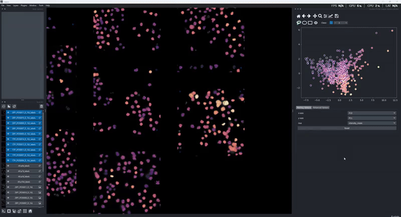

(intro)=

# napari-clusters-plotter

Welcome to the documentation pages of the napari-clusters-plotter. The clusters-plotter is designed to provide an easy, interactive interface for state-of-the-art tools for unsupervised machine learning in biological contexts.




## Installation

* Make sure you have Python in your computer, e.g. download [miniforge](https://github.com/conda-forge/miniforge).

* Create a new environment, for example, like this:

```
mamba create --name clusters-plotter python=3.12
```

If you never used mamba/conda environments before, take a look at [this blog post](https://biapol.github.io/blog/mara_lampert/getting_started_with_mambaforge_and_python/readme.html).

* **Activate** the new environment with `mamba`:

```
mamba activate clusters-plotter
```

* Install [napari](https://napari.org/stable/), e.g. via `mamba`:

```
mamba install -c conda-forge napari pyqt
```

Afterwards, install `napari-clusters-plotter` via `pip`:

```
pip install napari-clusters-plotter
```

To install latest development version :

```
pip install git+https://github.com/BiAPoL/napari-clusters-plotter.git
```

## Table of Contents

Here is an automatically generated Table of Contents:

```{tableofcontents}
```

[github]: https://github.com/BiAPoL/napari-clusters-plotter "GitHub source code repository for this project"
[tutorial]: https://docs.readthedocs.io/en/stable/tutorial/index.html "Official Read the Docs Tutorial"
[jb-docs]: https://jupyterbook.org/en/stable/ "Official Jupyter Book documentation"
