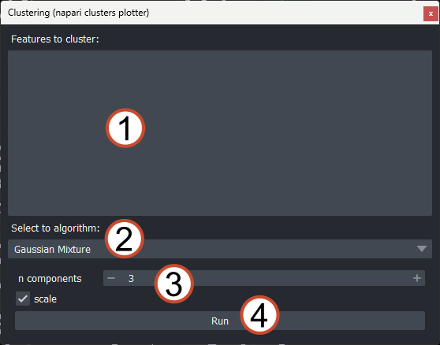
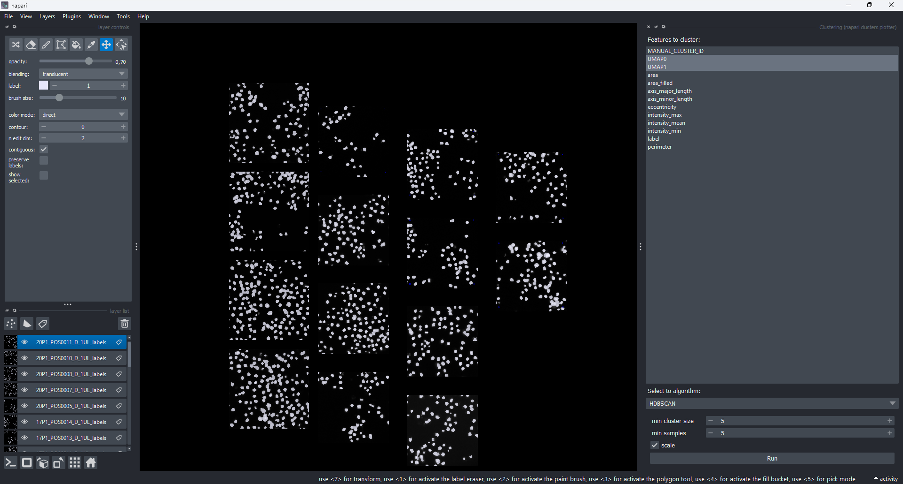
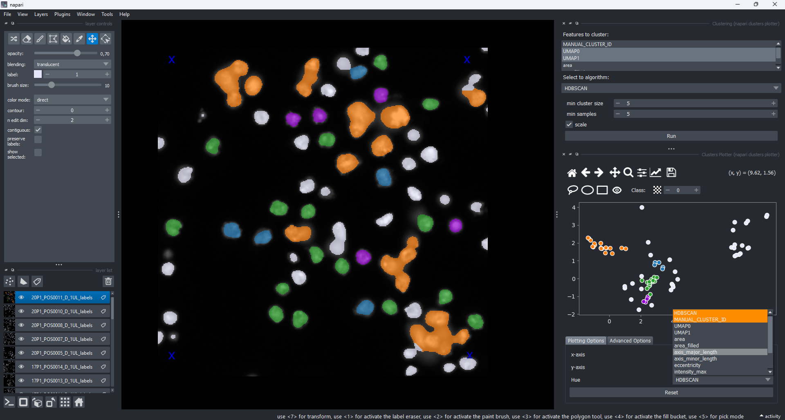
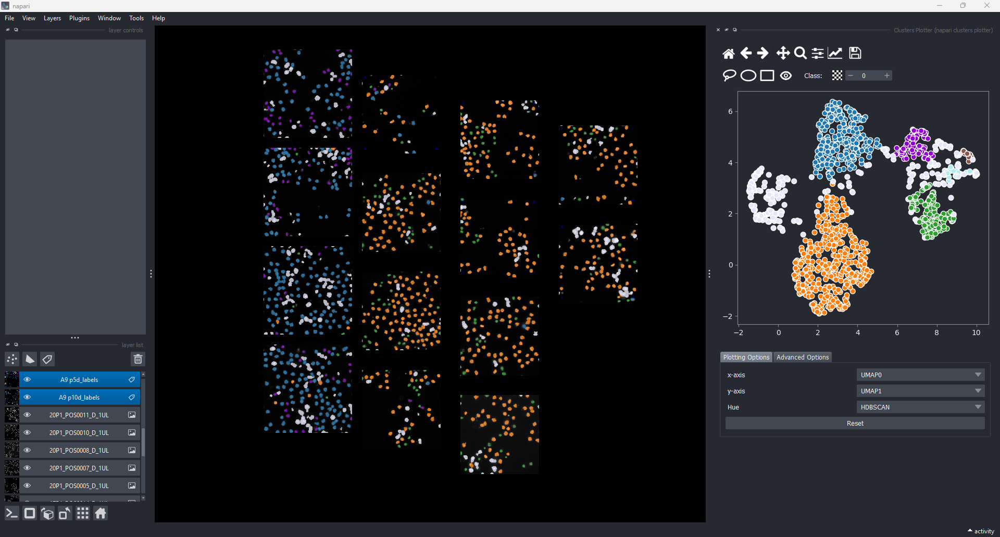

(widget:clustering)=
# Clustering

[Clustering](https://en.wikipedia.org/wiki/Cluster_analysis) is an unsupervised machine-learning technique to assign or detect groups among a group of objects according to provided features. This clustering can be done irrespective of the dimensionality of the feature space. The napari-clusters-plotter provides the following clustering algorithms:

- [KMEANS: K-means clustering](https://scikit-learn.org/stable/modules/generated/sklearn.cluster.KMeans.html)
- [HDBSCAN: Hierarchical density-based patial clustering of applications with noise](https://scikit-learn.org/stable/modules/generated/sklearn.cluster.HDBSCAN.html)
- [Gaussian Mixture](https://scikit-learn.org/stable/modules/generated/sklearn.mixture.GaussianMixture.html)
- [Spectral Clustering](https://scikit-learn.org/stable/modules/generated/sklearn.cluster.SpectralClustering.html)

## Widget overview

The functionality of the clustering widget is available to you as follows:



1. List of features that should be forwarded to the clustering algorithm
2. Selected algorithm for clustering (see available algorithms above)
3. Input parameters for selected algorithm (will change upon selecting different algorithm)
4. `Run` button - executes the algorithm.

## Running clustering

Similar to the [Dimensionality Reduction Widget](widget:dimensionality_reduction), the functionality of the Clustering Widget mirrors the [Plotter Widget](widget:plotter) to a large degree. To select features for clustering, simply select the layer with the features of interest in the napari layer list on the left. The available features are then automatically listed in the list of available features. For simmplicity, we use the `BBBC1 dataset & segmentations` dataset in this demo, too. While the clustering *can* be applied to any set of features, we aere applying it to a pre-computed, low-dimensional representation of the data. In this example, a UMAP reduction was used.

To run the algorithm, simply select the layer and the respective features and hit the `Run` button:



To visualize the result of the clustering, simply re-open the Plotter Widget. The results of the clustering algorithm are now available as a new categorical feature (marked in orange) in the `Hue` column:



```{note}
You *can* edit the result of the clustering algorithm in the Plotter Widget. To do so, select the result of the clustering in the `Hue` column and start drawing. This will **overwrite your previous manual selection** and replace it with the new, edited clustering result
```

## Cross-layer clustering

Finally, similar to the Plotter & Dimensionality Reduction Widget, the Clustering Widget also supports applying the available algorithms across several layers. To make use of this feature, simply select multiple layers. The feature list will then automatically be populated with features that are common to all selected layers. The limitations here are the same as for the [Plotter Widget](widget:plotter) and the [Dimensionality reduction widget](widget:dimensionality_reduction).


