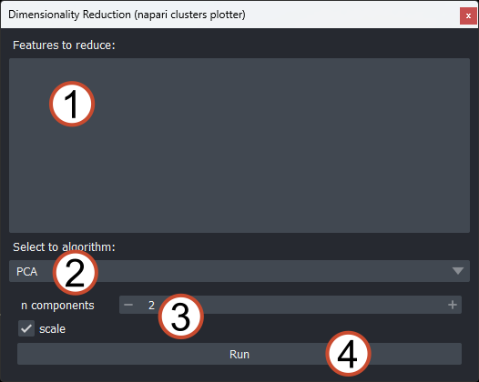
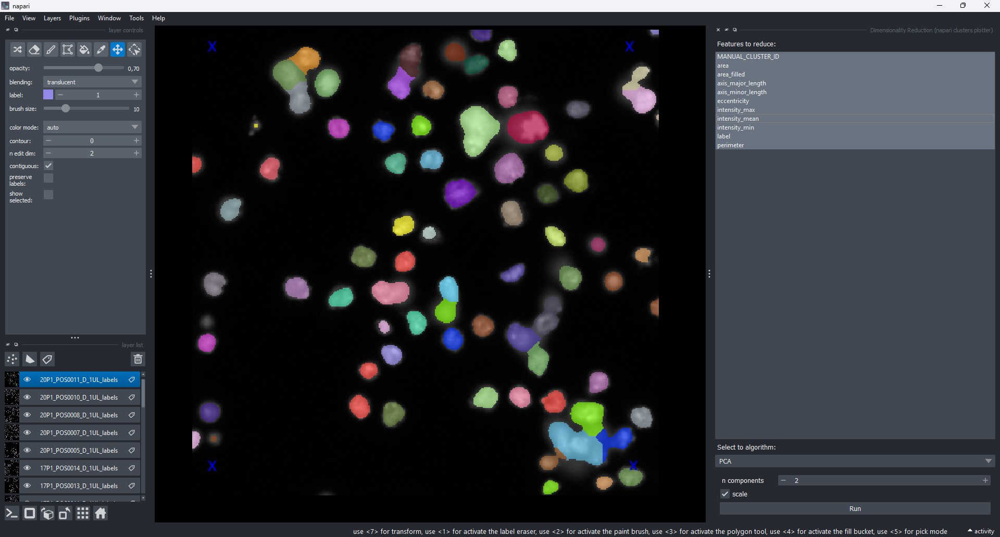
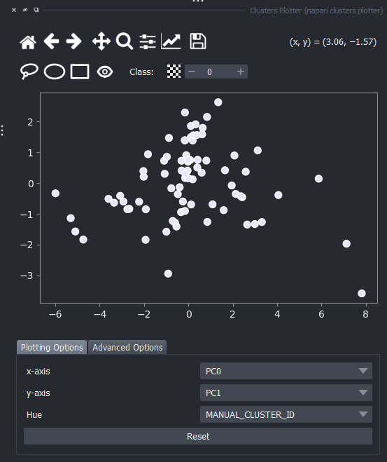
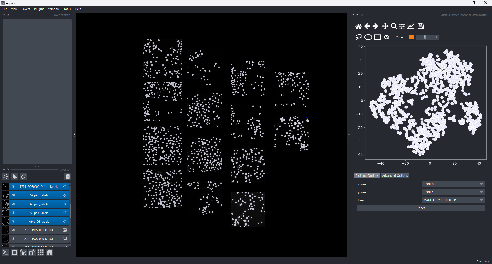

(widget:dimensionality_reduction)=
# Dimensionality reduction

[Dimensionality reduction](https://en.wikipedia.org/wiki/Dimensionality_reduction) is an unsupervised machine-learning technique to project high-dimensional feature spaces into lower dimensions, where we can introspect them easier. The napari-clusters-plotter currently supports the following algorithms for dimensionality reduction:

- [UMAP: Uniform manifold approximation and projection](https://umap-learn.readthedocs.io/en/latest/)
- [t-SNE: t-stochastic neighborhood embedding](https://scikit-learn.org/stable/modules/generated/sklearn.manifold.TSNE.html)
- [PCA: Principal component analysis](https://scikit-learn.org/stable/modules/generated/sklearn.decomposition.PCA.html)

The `Clustering Widget` is available in the napari viewer like this:

- `Plugins > napari clusters plotter > Dimensionality Reduction`

## Widget overview

The functionality of the dimensionality reduction widget is available to you as follows:

1. List of features that should be forwarded to the dimensionality reduction algorithm
2. Selected algorithm for reduction (see available algorithms above)
3. Input parameters for selected algorithm (will change upon selecting different algorithm)
4. `Run` button - executes the algorithm.

## Running dimensionality reduction

The functionality of the dimensionality reduction widget mirrors the [Plotter Widget](widget:plotter) to a large degree. To select features for dimensionality reduction, simply select the layer with the features of interest in the napari layer list on the left. The available features are then automatically listed in the list of available features.

Finally, to run the selected algorithm (by default PCA), select the features you want to forward to the algorithm as shown below and hit the `Run` button.

To visualize the result of the dimensionality reduction, simply re-open the Plotter Widget. The results of the dimensionality reduction algorithm have now been appended to the list of features for visualization:

## Cross-layer dimensionality reduction

Similar to the plotter widget, the dimensionality reduction widget also supports applying the available algorithms across several layers. To make use of this feature, simply select multiple layers. The feature list will then automatically be populated with features that are common to all selected layers. The limitations here are the same as for the Plotter Widget:

- Only features common to all selected layers are eligible for cross-layer dimensionality reduction
- Selecting layers of different kinds yields an error message

Depending on the chosen algorithm, the results of the dimensionality reduction algorithm are appended to the features table with an acronym that indicates the used algorithm (i.e., `UMAP0` and `UMAP1` for UMAP, etc). Selecting these features shows the result of the reduction algorithm:

