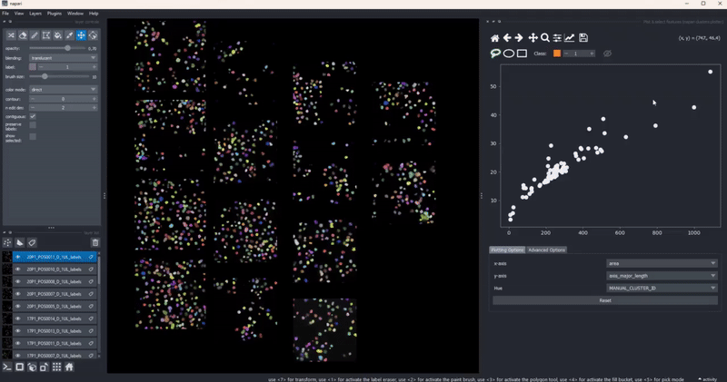

# Features

The napari-clusters-plotter provides a number of features, which shall be briefly described here. The three key components of the plugin are the [Plotter Widget](widget:plotter), the [dimensionality reduction widget](widget:dimensionality_reduction) and the [clustering widget](widget:clustering). It is immportant to understand, that all of these plugins operate almost exclusively on the `features` that are attached to supported napari layers.

## Supported layers

The clusters plotter currently supports the following layers:

- Labels layers
- Points layers
- Surface layers
- Vectors layers
- Shapes layers
- Tracks layers

It is important to understand that while the these layer types are all supported, the cluster plotter functionality depends entirely on the attached features, as written above. For a napari layer, the features are attached to a layer as an attribute (`layer.feature`). By default, it is simply a [pandas dataframe](https://pandas.pydata.org/pandas-docs/stable/reference/api/pandas.DataFrame.html) where each row refers to a single item in the respective layer. For the different layers, these correspond to:

- Labels: One row for one object with the same label
- Points: One row for each point
- Vectors: One row for each vector
- Shapes: One row for each shape
- Surface: One row for each vertex of the surface (face or edge features are not supported)
- Tracks: One row for every vertex in a tracking graph (coming soon)

## Selection persistence

When you draw a manual selection of data points, the selection is stored so that you can later return to it. As all clusters-plotter functionality also works across multiple layers, you can make selections on individual layers and later pool them together:

In combination with the dimensionality reduction and clustering algorithms, this gives you an easy to way to track how different algorithm parameters change outcomes and track these changes with respect to your data. Of course, cluster selection (manual or by algorithm) persist during such changes .

## Feature maps

The drawing of the plotted data is triggered whenever the data in the `layer.features` attribute has been updated. This gives trise to a few cool use cases of the clusters plotter. One of them is the simple generation of feature maps directly on top of an existing layer:

## Copy selected objects to new layers

In case you ever found yourself in the situation that you wanted to process or inspect an individual object from a layer separately from all the other objects without tedious image processing to pick out *just the right object*, you can now do this in the clusters plotter. Simply draw a selection in the canvas (using the `MANUAL_CLUSTER_ID`) as hue column or select any other categorical feature. Then use the cluster selector on the top of the canvas to select the object class you'd want to export and click the `Add current class as new layer button`!

