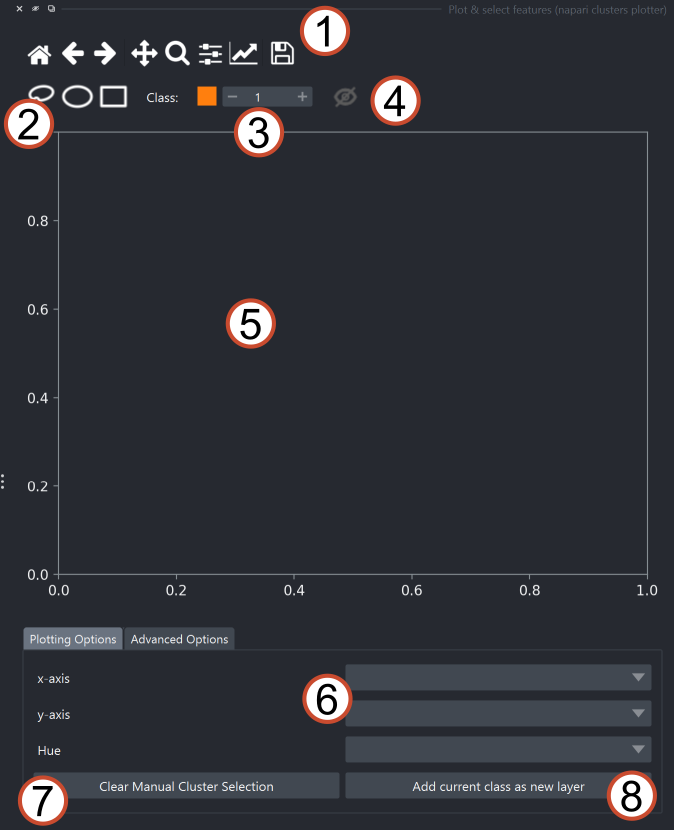
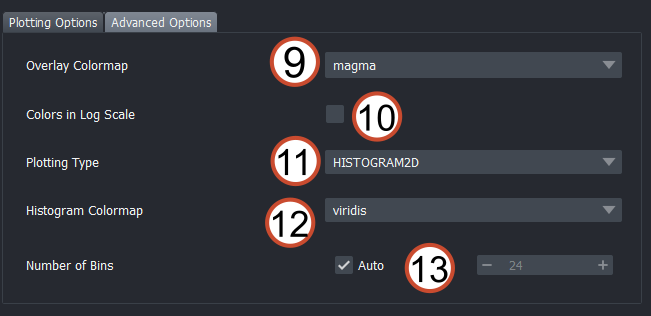
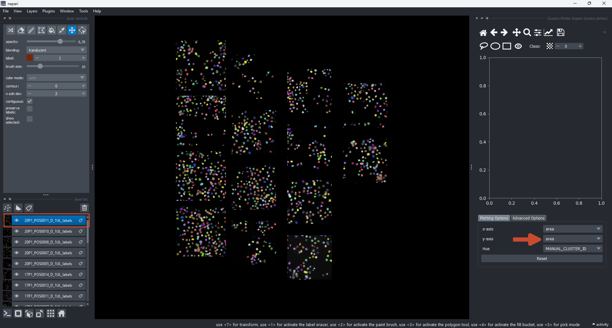

(widget:plotter)=
# Plotting

The plotter widget is the heart of the napari-clusters-plotter. To open it, open a napari viewer and find the Plotter Widget either under

- `Layers > Visualize > Plot & select features (napari-clusters-plotter)`
- `Plugins > napari-clusters-plotter > Plot & select features (napari-clusters-plotter)`

## Widget overview

The core functionality of the plugin is available to you directly upon opening it:

1. Standard [matplotlib toolbar](https://matplotlib.org/3.2.2/users/navigation_toolbar.html): Reset, Undo/Redo, Pan, Zoom, other plot properties & export
2. Tools to select points on the canvas:
    - Lasso selector
    - Ellipse selector (drag and drop, confirm with rightclick)
    - Rectangle selector (drag & drop, confirm with right-click)
3. Selected cluster index: Depending on which color/number is selected here, regions in the plot will be counted as members of this cluster group and highlighted accordingly
4. Show/Hide: Show or hide the selected points or histogram bins on the canvas.
5. Canvas: Features will be visualized here
6. What feature to plot on the x-axis and y-axis, respectively. The `Hue` dropdown controls the coloring of the data on the canvas, categorical features are highlighted in orange.
7. Reset button: Resets all drawn clusters

Under the `Advanced Options` tab, you have access to some more customization options for the visualization:

8. Change the colormap for the chosen overlay color. If a layer is colored by a non-categorical feature, this determines the colormap for the depiction. Only enabled if a non-categorical feature is selected in the `Hue` dropdown.
9. Apply a log-scale to the chosen feature
10. Switch plot type between `SCATTER` and `HISTOGRAM2D`

Depending on which plot type is selected, some additional options are available:

11. For `SCATTER` plot: 
    - Enable the time-frame highlighting. This make give out-of-frame points a different alpha and size, making them appear slightly more transparent and smaller. This is useful to visualize the current time frame in a time-series dataset. To make use of this, enusre that the measurements in the layer's `layer.features` dataframe contain a `frame` column, which is used to determine the current time frame.
    - Change the size of the points in the scatter plot. This can be useful for better visibility of the points in the plot in case there are a large number of points.

12. For `HISTOGRAM2D` plot:
    - Change the size of the bins (only enabled if `HISTOGRAM2D` is selected in 10.) Can be set to auto or a manual bin range can be set.
    - A different colormap for the histogram can be selected.

## Visualizing layer features

In order to visualize features from a dataset, you can load some of the sample data which accompanies the napari-clusters-plotter. You find the sample datasets under `File > Open Sample > napari-clusters-plotter > ...`. In this tutorial, we will use the `BBBC1 dataset & segmentations` dataset, (Jones et al., Proc. ICCV Workshop on Computer Vision for Biomedical Image Applications, 2005), available from the Broad Bioimage Benchmark Collection [Ljosa et al., Nature Methods, 2012] ([Link to data source](https://bbbc.broadinstitute.org/BBBC007))

The `features` of a [Labels layer](https://napari.org/stable/howtos/layers/labels.html) can be loaded into the Plotter Widget **simply by selecting it in the layer list** on the left:

The dropdown menus for `x-axis`, `y-axis` and `Hue` are then automatically populated with all available features. The features will be drawn as soon as you make the first change to the selected features. By default, the `MANUAL_CLUSTER_ID` is selected as the `Hue` value. This features stores all the drawn/selected items.

For Label layers, we can observe that the initial random label colors are retained by default (i.e., the selection overlay is invisible by default):

When we start drawing or untoggle the visibility button, we see the respective items showing up in the color we selected as cluster index (see above). If we want to reset the selection, we can press the `Reset` button. For `Labels` data, the color will revert back to the default (random colors) as soon as the layer is unselected. To retain the cluster selection, simply keep the layer selected in the napari layer list.

## Cross-layer visualization

A key feature of the napari-clusters-plotter is that you can select *multiple layers of the same type* and explore their features with the Plotter Widget. To do so, simply select multiple layers in the layer list of napari. Again, the aforementioned sample dataset (`BBBC1 dataset & segmentations`) is suitable to give this a try.

There are two things to keep in mind here:

- The features available for visualization is the *intersection of all features* that are common to all selected layers. If a feature `feature_x` is not present in all selected layers, it will not be available for visualization.
- Only features from the same layer type can be compared. If mixed layer types (e.g., `Labels` and `Points`) are selected, the drawing will fail.

## Visualizing non-categorical features

So far, the `Hue` selector was always set to `MANUAL_CLUSTER_ID`, which is by design a *categorical* column. However, the napari-clusters-plotter supports visualizing any feature as the `Hue` parameter. If this is done, the points are colored according to the selected feature and each point's color will be project on the respective object in the napari viewport. In essence, this creates feature maps for each feature you select:

